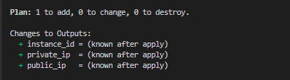

# tflocal EC2 Deployment with LocalStack

## Overview
This tflocal project sets up an EC2 instance using the `tflocal-aws-modules/ec2-instance/aws` module. The instance is configured to run on **LocalStack**, a local AWS cloud emulator. This setup allows users to test AWS deployments without incurring real AWS costs.

## Purpose
This guide is designed for users who are new to tflocal and unfamiliar with modules. It explains how the **three key tflocal files (`main.tf`, `outputs.tf`, and `variables.tf`)** work together and provides step-by-step instructions to set up and validate the infrastructure.

---

## How the Files Connect

1. **`main.tf` (Main Configuration File)**
   - Defines the **AWS provider** (LocalStack for local testing).
   - Calls the **EC2 module** to create an instance.
   - Configures instance properties, security groups, and storage.

2. **`variables.tf` (Variable Configuration File)**
   - Defines the **EBS volume configuration** as a variable.
   - Ensures the instance storage is dynamically configurable.

3. **`outputs.tf` (Output File)**
   - Extracts and displays key instance details such as **ID, public IP, and private IP**.

---

## Prerequisites
- Install **tflocal**: [Download tflocal](https://developer.hashicorp.com/tflocal/downloads)
- Install **LocalStack**: [LocalStack Installation Guide](https://docs.localstack.cloud/getting-started/installation/)
- Install **AWS CLI** (optional but recommended)

---

## Step-by-Step Guide

### **Step 1: Initialize tflocal**
Run the following command in your tflocal project directory:

```sh
tflocal init
```
This initializes the project and downloads the necessary modules and providers.

---

### **Step 2: Validate the Configuration**
To check for errors in your tflocal files, run:

```sh
tflocal validate
```
If the configuration is correct, you will see:

```
Success! The configuration is valid.
```

---

### **Step 3: Plan the Deployment**
To see what tflocal will create without actually applying it, run:

```sh
tflocal plan
```
If successful, you should see an output indicating that resources will be created.



---

### **Step 4: Apply the Configuration**
To create the EC2 instance and associated resources, run:

```sh
tflocal apply
```
Type `yes` when prompted to confirm the creation.

---

### **Step 5: Verify the Outputs**
After the resources are created, you can check the generated values by running:

```sh
tflocal output
```
This will display:
```
instance_id = "i-xxxxxxxxxxxxx"
public_ip = "xx.xx.xx.xx"
private_ip = "xx.xx.xx.xx"
```

---

## tflocal File Breakdown

### **`main.tf`** (Core Configuration)
```hcl
provider "aws" {
    region                      = "us-east-1"
    access_key                  = "mock_access_key"
    secret_key                  = "mock_secret_key"
    skip_credentials_validation = true
    skip_metadata_api_check     = true
    endpoints {
        ec2 = "http://localhost:4566"
    }
}

module "ec2_instance" {
    source  = "terraform-aws-modules/ec2-instance/aws"
    version = "~> 3.0"

    name           = "my-localstack-instance"
    instance_type  = "t2.micro"
    ami            = "ami-0c55b159cbfafe1f0"
    key_name       = "my-key"

    vpc_security_group_ids = ["sg-12345678"]
    subnet_id              = "subnet-12345678"

    ebs_block_device = [{
        device_name           = "/dev/sdh"
        volume_type           = var.ebs_volume.type
        volume_size           = var.ebs_volume.size
        iops                  = var.ebs_volume.iops
        encrypted             = var.ebs_volume.encrypted
        kms_key_id            = var.ebs_volume.kms_key_id
        delete_on_termination = var.ebs_volume.delete_on_termination
    }]

    iam_instance_profile = "my-iam-role"

    user_data = <<-EOF
                #!/bin/bash
                echo "Hello, DEVOPS PH!" > index.html
                nohup busybox httpd -f -p 8080 &
                EOF
}
```

---

### **`variables.tf`** (Variable Definitions)
```hcl
variable "ebs_volume" {
    description = "EBS volume configuration"
    type = object({
        size                 = number
        type                 = string
        iops                 = number
        encrypted            = bool
        kms_key_id           = string
        delete_on_termination = bool
    })
    default = {
        size                 = 20
        type                 = "gp2"
        iops                 = 100
        encrypted            = false
        kms_key_id           = ""
        delete_on_termination = true
    }
}
```

---

### **`outputs.tf`** (Outputs)
```hcl
output "instance_id" {
    description = "ID of the EC2 instance"
    value       = module.ec2_instance.id
}

output "public_ip" {
    description = "Public IP of the EC2 instance"
    value       = module.ec2_instance.public_ip
}

output "private_ip" {
    description = "Private IP of the EC2 instance"
    value       = module.ec2_instance.private_ip
}
```

---

## **Cleaning Up Resources**
To delete the infrastructure when you're done:

```sh
tflocal destroy
```
This will remove all resources created by tflocal.

---

## **Conclusion**
- You have successfully set up an **EC2 instance** using **tflocal modules** on **LocalStack**.
- This project demonstrates **modular tflocal** usage, ensuring a scalable and reusable infrastructure.
- **Next Steps:** Try modifying the `variables.tf` file to change instance size or EBS volume properties!
