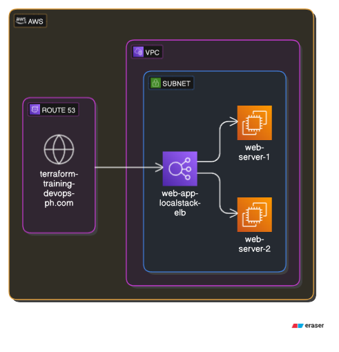

# Terraform Infrastructure for Web Application with LocalStack

## Architecture Overview

This Terraform configuration simulates a basic web application infrastructure using LocalStack to emulate AWS services.

### Resources Defined:
1. **VPC**:
    - A Virtual Private Cloud (`aws_vpc`) with CIDR block `10.0.0.0/16`.
  
2. **Subnet**:
    - A subnet within the VPC with CIDR block `10.0.1.0/24`.

3. **Security Groups**:
    - `web-app-localstack-sg`: Allows HTTP inbound traffic (port 80) to web servers.
    - `alb-localstack-sg`: Allows HTTP inbound and outbound traffic for the Load Balancer.

4. **Web Servers (EC2 Instances)**:
    - Two `aws_instance` resources are defined using the Ubuntu 20.04 LTS AMI, each running a basic `busybox` HTTP server on port 80.
  
5. **Load Balancer (ALB)**:
    - An Application Load Balancer (`aws_lb`) is set up to distribute traffic across the web servers. 
    - **Note**: ELB support in LocalStack (free version) is limited, leading to errors during `terraform apply`.

6. **Target Groups**:
    - `web-app-localstack-tg`: A target group for the load balancer containing the web servers.
  
7. **Route 53**:
    - A Route 53 hosted zone and DNS record are configured for the domain `terraform-training-devops-ph.com`, pointing to the Load Balancer.

### Architecture Diagram

The architecture diagram below provides a visual representation of the infrastructure setup. It shows the VPC, security groups, web servers, Load Balancer, and Route 53 configuration.

## Challenges Faced and Solutions

1. **ELB Support in LocalStack**:
    - LocalStack’s free version does not fully support `aws_lb` and related ELB services. This led to a `501 InternalFailure` error.
    - **Solution**: The Load Balancer configuration was left in place, but it couldn’t be fully tested with LocalStack's free version. 

2. **Security Group Duplication**:
    - The error `InvalidGroup.Duplicate` occurred due to pre-existing security groups in LocalStack.
    - **Solution**: Restarted the localstack `ctrl+c` thus cleaning the infrastructure state.

3. **State Management**:
    - Terraform required reinitialization after backend configuration changes.
    - **Solution**: Ran `terraform init -reconfigure` to reinitialize the working directory with the correct configuration.

## Switching from Terraform to tflocal

- During the process, we faced an issue with `InvalidClientTokenId` when using the default Terraform setup with LocalStack. This error prevented resources from being applied correctly.
- To bypass this issue, we switched to using `tflocal`, a wrapper that makes Terraform work seamlessly with LocalStack. This tool handled the client token and other related issues, allowing us to successfully apply the Terraform configuration to LocalStack without the token error.

## Conclusion

The Terraform setup was successfully applied for local testing of AWS infrastructure using LocalStack and `tflocal`. However, certain AWS services like Load Balancers were not fully functional due to limitations in the free version of LocalStack.
